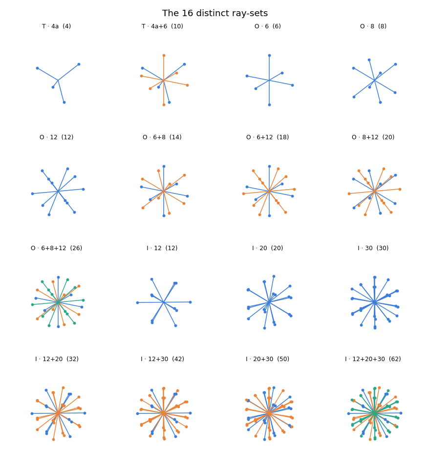
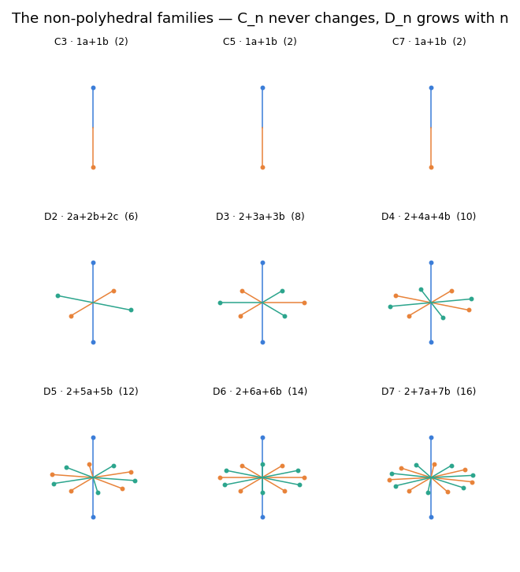
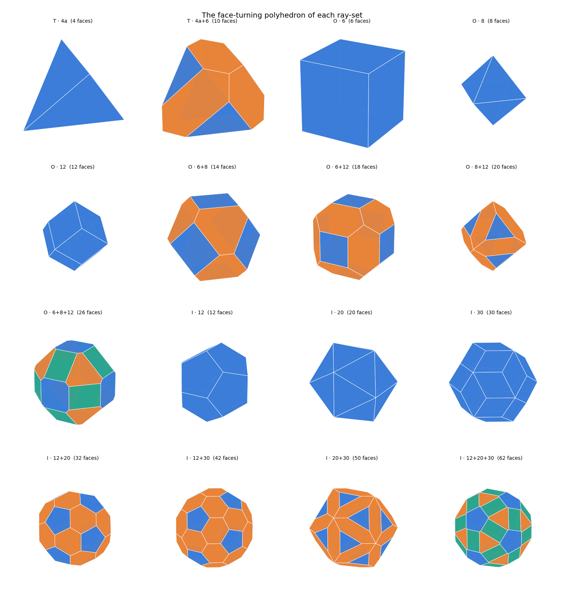
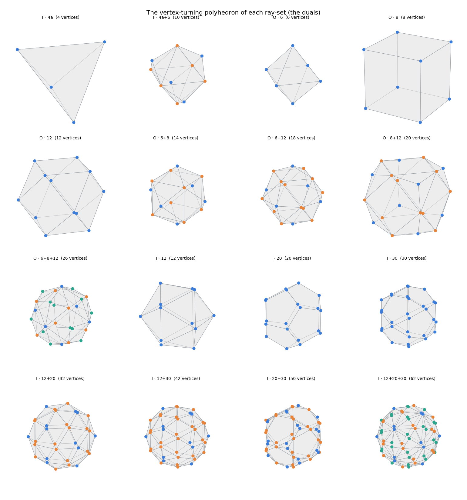
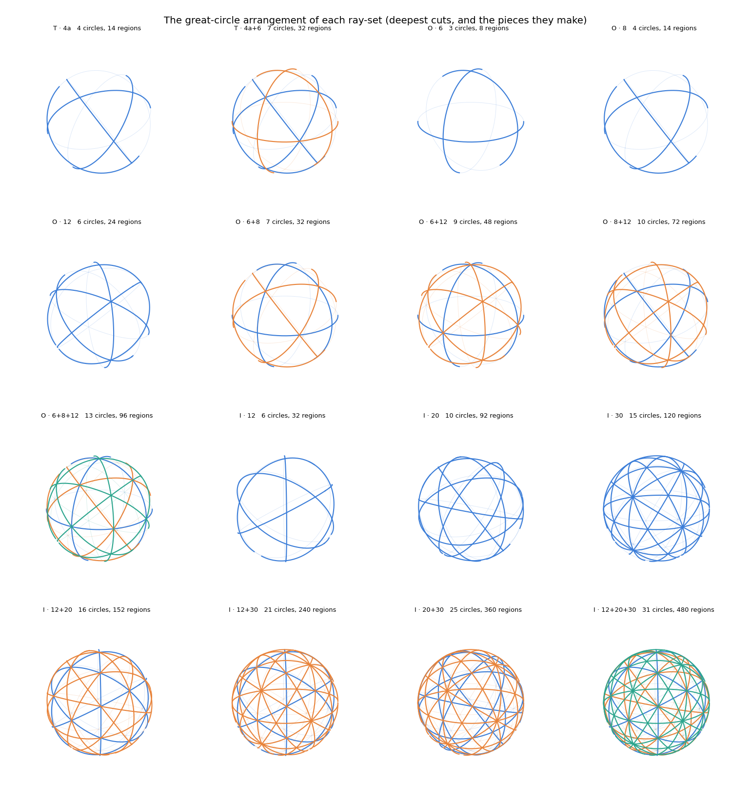

# ray-sets

Every twisty-puzzle axis system with polyhedral symmetry — enumerated, verified, and
drawn.

A **ray-set** is the skeleton of a twisty puzzle: the set of directions you can turn
around, and nothing else. Draw an arrow from the centre of a Rubik's Cube out
through each face centre and you have that puzzle's ray-set — six rays. Strip away
the colours, the stickers, the cutting depth, and this is what remains.

The one rule a ray-set must obey is physical: **spin the whole set around any one of
its own rays, and it has to land back on itself.** If some ray lands where no ray
was before, a turn would drive a piece into solid plastic and the puzzle jams.

That single constraint turns out to be ferocious:

> **Every twisty puzzle built on polyhedral symmetry — including every one nobody
> has invented yet — has one of exactly 16 axis systems. There is no seventeenth.**

Note what kind of claim that is. It is not a survey of puzzles people have made; it
is a statement about the **unbuilt**. Someone could design a genuinely novel puzzle
tomorrow, and its axis geometry is already on the list below.

Two non-polyhedral families — prisms and turntables — sit outside this count, for
reasons worth understanding: see [Beyond the 16](#beyond-the-16).

For the formal definitions (and the finer notion of a *turning system*), see
[`intro.md`](intro.md). This file is the practical tour.



## The 16

Ray-sets are built from three symmetry shapes — **T** (tetrahedral), **O**
(octahedral), **I** (icosahedral). Each shape has three families of rays, and a
ray-set is any non-empty combination of whole families. Labels below are the ones
the tools print: `O · 6+8` means "shape O, the 6-family plus the 8-family."

For **O**, the families are the cube's 6 faces, 8 corners, 12 edges. For **I**, the
dodecahedron's 12 faces, 20 corners, 30 edges. For **T**, the tetrahedron's 4
corners, 4 faces and 6 edges — though only two of T's seven combinations survive
de-duplication, for reasons given below.

### Octahedral — 7

| label | rays | puzzles |
|---|---|---|
| `O · 6` | 6 | **3x3x3 Rubik's Cube**, Magic Octahedron |
| `O · 8` | 8 | **Skewb**, Dino Cube, Face-Turning Octahedron |
| `O · 12` | 12 | **Helicopter Cube**, Curvy Copter |
| `O · 6+8` | 14 | rarely built — see note |
| `O · 6+12` | 18 | rarely built |
| `O · 8+12` | 20 | rarely built |
| `O · 6+8+12` | 26 | rarely built |

### Icosahedral — 7

| label | rays | puzzles |
|---|---|---|
| `I · 12` | 12 | **Megaminx**, Pyraminx Crystal |
| `I · 20` | 20 | **Starminx I**, Radiolarians, Astrominx |
| `I · 30` | 30 | Dodecacopter |
| `I · 12+20` | 32 | **Tuttminx** |
| `I · 12+30` | 42 | rarely built |
| `I · 20+30` | 50 | rarely built |
| `I · 12+20+30` | 62 | rarely built |

### Tetrahedral — 2

| label | rays | puzzles |
|---|---|---|
| `T · 4a` | 4 | **Pyraminx**, Pyraminx Duo, Halpern-Meier Tetrahedron |
| `T · 4a+6` | 10 | jumbling tetrahedra — no standard commercial example |

**A note on the examples.** The geometry is exact; the puzzle names are not a
guarantee that a thing exists on a shelf. The multi-family rows in particular —
14, 18, 20, 26, 42, 50 — are seldom built physically, and often live only as
one-off customs or in simulators. A ray-set says a mechanism is geometrically
coherent, not that anyone has moulded the plastic.

Unlike the geometry, these names have **not** been individually verified against a
puzzle database — treat them as pointers rather than citations.

**Why only 2 from T.** The tetrahedron has three families (4 corners, 4 faces, 6
edges), so it starts with 7 combinations like the others. Five of them turn out to
be duplicates: two are mirror images of the others, and three coincide exactly with
octahedral ray-sets — the tetrahedron's 4 corners plus its 4 faces *are* the cube's
8 corners. So 21 candidates collapse to 16. The tools verify this rather than
assume it (see below).

## Beyond the 16

The 16 are the ray-sets whose symmetry is **polyhedral** — T, O, or I. Two other
kinds of symmetry exist in 3D, and it's worth being precise about what they
contribute, because the two behave very differently:



- **Prisms (dihedral, $D_n$)** — genuinely infinite. Its ray families come out as
  sizes $2, n, n$, for $2n+2$ rays in total, and the geometry really does change
  with $n$: a pentagonal prism's ray-set is not a hexagonal prism's. One new batch
  of ray-sets for every $n$, forever. Cuboids like the 2x2x4 and the
  hexagonal-prism puzzles live here.
- **Turntables (cyclic, $C_n$)** — *not* infinite, as ray-sets. A turntable has one
  axis, so its poles are just the two ends of it: the pole set is
  $\{(0,0,1), (0,0,-1)\}$ for **every** $n$. A 5-fold turntable and a 17-fold
  turntable have the identical ray-set. All of $C_n$ contributes is a single ray and
  a pair of opposite rays.

So "16 plus two infinite families" isn't quite right. The infinitude of $C_n$ lives
entirely in the *turn order*, which a ray-set deliberately forgets; only $D_n$ is
infinite as geometry. The two are excluded for completely different reasons:

> **$D_n$ is excluded because it is genuinely infinite.**
> **$C_n$ is excluded because it is degenerate** — one axis is not much of an axis
> *system*.

The families aren't disjoint from the 16 either: $D_2$'s full pole set is exactly
`O · 6`, the Rubik's Cube.

### A worked example of each

**Pentagonal prism → $D_5$.** Take a pentagonal prism and turn its faces — the 2
pentagonal faces by 72°, the 5 rectangular faces by 180°. A real, legal puzzle, and
its ray-set has **7 rays**, not the 12 of $D_5$'s full pole set.

Why 7 and not 12: because 5 is odd. Follow the 2-fold axis out through the centre of
a rectangular face and it leaves the far side through the midpoint of a vertical
*edge* — there is no opposite face. So the ten 2-fold poles split into two families
of five, one of face centres and one of edge midpoints, and a face-turning puzzle
uses only the face-centre family. Hence $2 + 5 = 7$. Turning about the vertical
edges as well would use all 12.

Now swap the pentagon for a hexagon, a heptagon, a 50-gon. Each is equally legal and
each is a *different* ray-set — 7, 8, 9, … rays. No finite list can hold them all,
which is precisely why the theorem is scoped to polyhedral ray-sets.

**1x1xN cuboid → $C_4$.** The purest turntable puzzle there is: every move is a
rotation about a single axis, with no sliding (unlike Babylon Tower or Missing Link,
which mix in sliding moves).

One trap in the notation: **the $N$ in 1x1xN is not the $n$ in $C_n$.** The turn
order comes from the *cross-section*, which is a square — so the turns are 90° steps
and a 1x1x2 and a 1x1x100 are both $C_4$. Making the puzzle longer adds layers, not
symmetry. To range over $C_n$ you would vary the cross-section instead: an n-gonal
tower gives $C_n$.

So the entire infinite 1x1xN family collapses to a **single** ray-set of 2 rays. A
1x1x2 and a 1x1x100 share not just a ray-set but a turn order, while differing
enormously as puzzles. That is the degeneracy, about as concretely as it gets.

## Scope, honestly

**16 ray-sets is not the same as 16 puzzle mechanisms.** A ray-set records only the
*directions you can turn*. Everything else is deliberately discarded:

- **How far each ray turns.** A 3x3x3 and a 3x3x2 Domino have the same six-ray set.
- **How many parallel layers you cut.** A 2x2x2, 3x3x3, 4x4x4 and 7x7x7 all have the
  identical ray-set, `O · 6`. A 1x1x2 and a 1x1x100 likewise match each other — at
  2 rays, not 6.
- **How deep the cuts go.** Shallow- and deep-cut versions of the same axes agree.

That omission is load-bearing, not sloppiness: it's what makes the list finite and
provable. Restore turn orders and you get *turning systems*
([`intro.md`](intro.md)), a strictly finer classification — and an infinite one,
since $D_n$ runs unbounded. The clean finite theorem is about ray-sets, which is
exactly why it's stated that way.

## The mathematics is not new

The load-bearing theorem here is classical. That the only finite rotation groups in
3D are $C_n$, $D_n$, $T$, $O$ and $I$ has been known since the nineteenth century,
and is usually credited to **Felix Klein** — his *Lectures on the Icosahedron*
(1884) is the canonical treatment — building on earlier work in crystallography by
Hessel and Bravais. The counting argument that pins it down, $\sum_i (1 - 1/n_i) =
2 - 2/N$, is standard orbit-counting and appears in any algebra course that covers
group actions.

What this repository adds is not the theorem but the *working out*: casting the
result in terms of ray-sets, enumerating the 21 candidates, verifying the collapse
to 16 with explicit maps rather than assertion, and letting you look at every one of
them.

For the theorem itself — its history and a full proof written for a reader with only
high-school maths — see [`klein.md`](klein.md). It derives
$\sum_i (1 - 1/n_i) = 2 - 2/N$ from scratch and solves it, showing why $C_n$, $D_n$,
$T$, $O$ and $I$ are the *only* possibilities.

## The code

The scripts need only NumPy and matplotlib; the notebook also needs `ipywidgets`
and `ipympl` for its interactive controls.

```bash
pip install -r requirements.txt
```

The repository is organised as three investigations, in reading order — the
directions you can turn, then how far, then where you cut:

### [`1_ray_sets/`](1_ray_sets) — the 16

| file | what it does |
|---|---|
| `raysets.py` | builds T/O/I, extracts ray families, enumerates the 21 candidates, proves the collapse to 16; also `cyclic(n)` and `dihedral(n)` for the non-polyhedral families |
| `rayview.py` | interactive 3D viewer — drag to rotate, arrow keys to step through |
| `rayview.ipynb` | the same viewer with a dropdown, plus a $C_n$ / $D_n$ explorer with a slider for `n` |
| `preview.py` | regenerates the three montage images |

```bash
cd 1_ray_sets
python raysets.py     # print all 21, then the de-duplication report
python rayview.py     # open the interactive viewer
python preview.py     # rebuild the three montage PNGs
```

Two further ways to *see* the same 16, each in its own subfolder with a script,
an interactive notebook, and a montage:

#### [`1_ray_sets/polyhedra/`](1_ray_sets/polyhedra) — as solids

Every ray-set is the face set of one convex polyhedron: put a plane perpendicular to
each ray and a face appears for every ray. `O · 6` is a cube, `O · 8` an octahedron,
`I · 12` a dodecahedron — the Megaminx. The combinations give the truncated solids
(`I · 12+20` is the soccer ball). Faces are coloured by ray family.



The **dual** construction — the convex hull of the ray tips — makes each ray a
*vertex* instead of a face, giving the vertex-turning polyhedron. `O · 6` becomes an
octahedron, `I · 12` an icosahedron. It is the same axis system seen the other way
up; the notebook toggles between the two.



#### [`1_ray_sets/great_circles/`](1_ray_sets/great_circles) — as cuts

For each ray, the great circle perpendicular to it is where the deepest cut about
that axis meets the sphere — so this is the puzzle's cut pattern rather than its
axes. The circles carve the sphere into regions, and those are the pieces of the
deepest-cut puzzle: `O · 6` → 8 (a 2x2x2), `I · 12` → 32 (the Pentultimate). The
count is exact, from Euler's $V - E + F = 2$.



### [`2_turning_systems/`](2_turning_systems) — the 21

Adds *how far* each ray may turn. See
[`turning_systems.md`](2_turning_systems/turning_systems.md) for the result.

```bash
cd 2_turning_systems
python turning_systems.py
```

### [`3_cut_depths/`](3_cut_depths) — where you cut

Not written yet. This is where the count stops being finite.

Nothing is hard-coded. The groups are closed from two rotations each, the families
are found as orbits, and the 21 → 16 collapse is **proved** rather than asserted:
ray-sets are first grouped by a fingerprint (sorted pairwise dot products, which is
unchanged by rotation and reflection), and then every proposed merge must be
confirmed by exhibiting an actual orthogonal map carrying one set onto the other.
That second step matters — a fingerprint is invariant but not injective, so a
match alone would not be proof.

The viewer shows all **21** candidates, including the five redundant ones, so you
can see a mirror pair sitting next to each other before they collapse.
